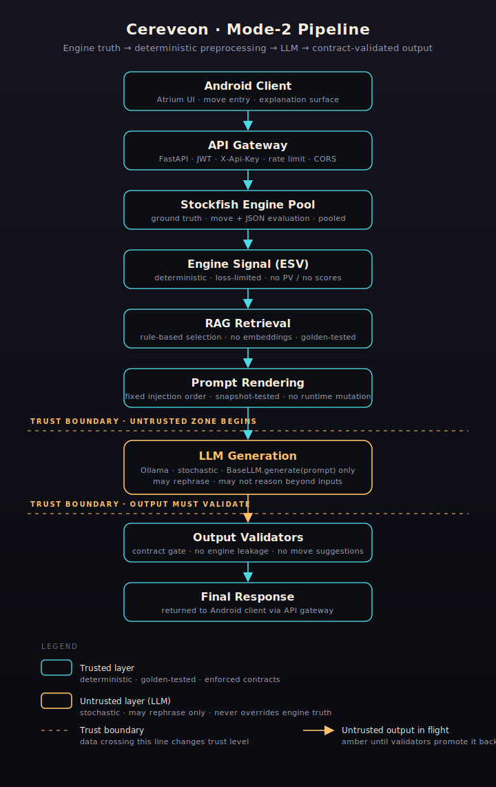

ARCHITECTURE.md
Scope

This document defines the architecture and invariants of the ChessCoach-AI Mode-2 system.

The architecture exists to guarantee:

correctness

determinism

non-hallucination

long-term maintainability

Any change that violates an invariant defined here is invalid.

System Role

ChessCoach-AI Mode-2 is a non-calculating chess explainer.

It:

explains evaluations

explains ideas

explains mistakes

It does not:

calculate moves

suggest moves

explore variations

override engine evaluations

High-Level Data Flow

Stockfish JSON (ground truth)
        ↓
Engine Signal Extraction (ESV)
        ↓
RAG Retrieval (document selection)
        ↓
Prompt Rendering (Mode-2)
        ↓
LLM Generation (untrusted)
        ↓
Output Validation (mandatory)
        ↓
Final Response

No step may be skipped or reordered.

Trust Boundaries
Component	Trust Level
Stockfish JSON	Trusted
Engine Signal (ESV)	Trusted
RAG Documents	Trusted
Prompt Renderer	Trusted
LLM	Untrusted
Output Validators	Trusted

The LLM is never trusted.

Engine Signal (ESV)
Definition

The Engine Signal Vector (ESV) is a normalized, loss-limited representation of engine output.

It is the only engine-derived input allowed downstream.

Properties

Extracted deterministically

No numeric precision beyond coarse bands

No move lists

No search metadata

Forbidden

Raw engine output

Principal variations

Depth, nodes, or scores

RAG Retrieval
Definition

RAG retrieval selects explanatory documents based solely on the ESV.

Rules

Retrieval is deterministic

Conditions are explicit

No semantic search

No embedding similarity

Output

A list of document contents that may be used in explanation.

Trade-off

Rule-based retrieval is what makes the rest of the architecture auditable
— every document selection is reproducible from the ESV, golden-testable,
and inspectable in `llm/rag/retriever/rule_matcher.py`. The cost is recall:
positions whose ESV signature matches no rule in the corpus return an
empty document list. The pipeline does not refuse the request in that
case. `retrieve()` returns `[]`; `render_mode_2_prompt` substitutes the
placeholder string `(no retrieved context)` for the RAG section; the LLM
generates against the system prompt and the ESV alone, and the
downstream validators (output firewall + Mode-2 contracts) still enforce
every safety claim regardless of how thin the retrieved context is.

The "degraded but not refused" choice is deliberate. Refusing to answer
would punish callers for corpus gaps that are correctness-irrelevant
(retrieval enriches the explanation; it does not gate truth — engine
truth comes from the ESV). Operationally, sustained empty-retrieval
rates indicate a corpus gap, not a model failure; the documented
mitigation is corpus expansion (a new conditioned document), never a
switch to semantic search.

Prompt Rendering (Mode-2)
Definition

Prompt rendering injects:

system prompt

engine signal (verbatim)

RAG context (verbatim)

FEN

optional user query

Rules

Injection order is fixed

Prompt snapshots are golden-tested

No dynamic prompt rewriting

LLM Layer
Role

The LLM is a language realizer only.

It may:

rephrase

explain

contextualize

It may not:

reason beyond provided inputs

introduce new facts

contradict engine evaluation

LLM Interface

All LLMs must implement:

class BaseLLM:
    def generate(self, prompt: str) -> str

No additional methods are allowed.

Output Validation
Definition

All LLM outputs must pass contract validation before being returned.

Enforced Rules

No engine mentions

No move suggestions

No invented tactics

Correct handling of forced mate

Explicit refusal on missing data

Validation failure is a hard error.

Fake LLM
Purpose

The Fake LLM exists to:

test validators

simulate violations

prove enforcement

It is not optional.

Real LLM Integration
Rules

Real LLMs must be wrapped via BaseLLM

Real LLM outputs must pass the same validators

Real LLM tests must not run in CI

Determinism Guarantees
Layer	Deterministic
ESV extraction	Yes
RAG retrieval	Yes
Prompt rendering	Yes
Validators	Yes
LLM output	No

Non-determinism is isolated to the LLM only.

Failure Handling
Missing Data

If required engine information is missing:

Explanation must explicitly state this

No chess content may be generated

Forced Mate

If evaluation type is mate:

Inevitability must be emphasized

Long-term planning must not be discussed

/chat Endpoint — Per-Turn Grounding Semantics

The /chat endpoint accepts a conversation history (a list of role + content
turns) and a single FEN representing the current board position. Despite the
multi-turn surface, the trust-boundary semantics are identical to single-shot
/explain — they hold per turn.

Per-Turn ESV Re-Extraction

The Engine Signal Vector is re-extracted from the FEN supplied by the caller
on every turn — see the `extract_engine_signal({}, fen=fen)` call at the top
of `generate_chat_reply` in `llm/seca/coach/chat_pipeline.py`.

The ESV is never carried forward across turns. The caller is responsible for
supplying a fresh FEN; the pipeline accepts no past FENs and stores no
positional state. Each turn's prompt is rendered with the current ESV, RAG
documents retrieved from that ESV, and the message history.

No Cross-Turn Position References

Past board positions are not retrievable from inside the pipeline. The
`ChatTurn` dataclass (defined in `llm/seca/coach/chat_pipeline.py`) carries
only `role` and `content` (text) — never a FEN, never an ESV, never any
structural board state. The LLM may see prior textual turns in the
conversation history (capped at the most-recent `_MAX_HISTORY_TURNS` turns
when rendered into the prompt), but it has no FEN to ground-reason from for
any turn other than the current one.

Asking "what about the position five moves ago?" is therefore unanswerable
by construction — the model must defer to the current FEN's ESV or refuse.

50-Turn API Cap Is Not a Trust Mechanism

The /chat endpoint enforces a 50-turn cap on the message-history field at
the HTTP boundary (the `ChatRequest` Pydantic validator in
`llm/server.py`). This cap exists to bound prompt length, not to enforce
trust. The per-turn ESV grounding above is what enforces trust; the cap
merely prevents pathological prompts.

20-Turn Compaction Is Token-Budget Only

When the message list reaches `COMPACT_THRESHOLD = 20` turns,
`llm.seca.coach.context_compact.compact_history` deterministically replaces
older turns with a structured summary (mistakes / strengths / topics
covered) and keeps the `COMPACT_KEEP_RECENT = 6` most-recent turns
verbatim. Compaction is rule-based — no LLM call. It does not preserve
past FENs (none were ever stored), does not extract additional ESVs, and
the summary is text only.

Trust Property

For every turn N in a conversation, the response is grounded in the FEN at
turn N. The trust-boundary diagram (`docs/architecture-diagram.svg`) holds
per turn: prompt rendering composes the current ESV, RAG documents selected
from that ESV, and the conversation-history text. The LLM output is then
validated by the Mode-2 contract validators and the output_firewall (see
the Validator Coverage Matrix in `docs/TESTING.md`). No turn can leak
engine truth from a different position because no other position exists in
the pipeline at that point in time.

If the caller supplies a stale or wrong FEN, the response will be grounded
in that FEN's ESV — that is a caller bug, not a trust escape. The /move
endpoint is the only route that produces canonical follow-up FENs;
clients should pass the FEN returned by /move (or computed from the known
move list) into /chat verbatim.

Test Coverage Mapping
Architecture Layer	Protected By
ESV	Golden tests
RAG	Golden tests
Prompt	Snapshot tests
Validators	Contract tests
LLM behavior	Regression tests

No layer is unprotected.

Change Rules
Allowed Changes

Add new RAG documents

Add new golden cases

Improve explanation wording (within contracts)

Add new LLM adapters

Forbidden Changes

Weakening validators

Bypassing ESV

Prompt mutation at runtime

LLM reasoning beyond inputs

Non-Goals

This architecture does NOT:

evaluate chess skill

compete with engines

provide move recommendations

simulate human calculation

Invariants

If all CI tests pass, the system is guaranteed to:

never hallucinate engine facts

never contradict evaluations

never suggest moves

remain regression-safe

End of ARCHITECTURE.md